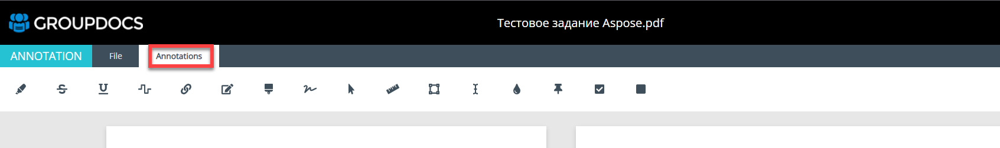
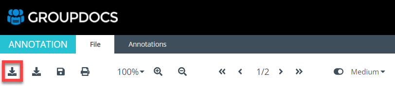
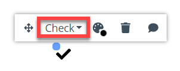

### Table of Contents
  [Section 1. GroupDocs.Annotation Overview](#section-1-groupdocsannotation-overview)
- [Section 1. GroupDocs.Annotation Overview](#section-1-groupdocsannotation-overview)
  - [Features Demo Preparation](#features-demo-preparation)
  - [GroupDocs.Annotation Examples](#groupdocsannotation-examples)
    - [Quick Start](#quick-start)
    - [Basic Usage](#basic-usage)
    - [Advanced Usage](#advanced-usage)
- [Section 2. GroupDocs.Annotation User Guide](#section-2-groupdocsannotation-user-guide)
  - [Step 1. Upload a Document](#step-1-upload-a-document)
  - [Step 2. Work with the Uploaded File](#step-2-work-with-the-uploaded-file)
  - [Step 3. Edit Annotations and Save the Document](#step-3-edit-annotations-and-save-the-document)


# Section 1. GroupDocs.Annotation Overview

The [document annotator library](https://products.groupdocs.com/annotation/) allows exporting documents after adding annotations, comments or highlighted notes back to its original format. It also provides a handy set of data objects through which one can customize annotations as per certain requirements.

GroupDocs.Annotation core features:
- Import document annotations;
- Add, remove or reply to annotation comments;
- Export annotated document back to its original format;
- Render document pages as images;
- Generate document thumbnails or document image preview;
- Fetch document information, such as, page count & file size;
- Extract annotations from a document and serialize to XML format;
- Remove previously added annotations from a document;
- Update specific annotation properties (size, color etc.).

GroupDocs.Annotation for .NET is a comprehensive set of APIs that helps build document annotation management applications in C#, ASP.NET and other related .NET technologies. The following annotation types are supported:
- area;
- point; 
- text;
- ellipse;
- link;
- underline;
- polyline;
- arrow;
- distance;
- watermark;
- image.

The listed annotation can be added to: 
- PDF;
- HTML;
- Microsoft Office Word;
- Microsoft Office Excel;
- PowerPoint presentations;
- Visio;
- images;
- CAD drawing and various other formats. 

GroupDocs.Annotation is available in several solutions:
- [High Code API](https://products.groupdocs.com/annotation/);
- [Low Code API (cloud)](https://products.groupdocs.cloud/annotation/);
- [No Code Apps](https://products.groupdocs.app/annotation).

For demo purposes only, we will be using a .NET version as an example to showcase the possibilities of the GroupDocs.Annotation. However, the functionality will stay the same, no matter which solution is selected, the end user experience will not differ. 

Visit the following links for additional information:
* [Code repository](https://github.com/groupdocs-annotation/GroupDocs.Annotation-for-.NET).
* [Supported file formats](https://docs.groupdocs.com/annotation/net/supported-document-formats/).
* [Installation procedure](https://docs.groupdocs.com/annotation/net/installation/).
* [System requirements](https://docs.groupdocs.com/annotation/net/system-requirements/).
* [Annotation Library](https://releases.groupdocs.com/annotation/net/).
* [Pricing](https://purchase.groupdocs.com/pricing/annotation/net).

## Features Demo Preparation

In order to showcase several features of our SDK, the Aspose Team prepared several code examples which can be run locally on a PC. 

There are several possible options how one can run the provided examples:
|Tool|Build procedure|
|:---|:---|
|Visual Studio|Follow the given steps to proceed with project build:<ul><li>Extract the downloaded project and open the solution file in Visual Studio.</li><li>Right click on solution and press "Enable NuGet package Restore".</li><li>Build the project.</li></ul><br>Sometimes Visual Studio is unable to automatically add APIs references due to Visual Studio version differences. In this case, please add references of missing APIs manually.|
|Docker Container|Follow the given steps to proceed with project build:<ul><li>Navigate into Examples directory.</li>Build an image <code>docker build --pull -t annotation:examples</code>.<li>Run a container:</li><ul><li>Windows Command Line (CMD):<br><code>docker run --rm -it -v %cd%:/examples/Results annotation:examples</code></li><li>Powershell:<br><code>docker run --rm -it -v ${PWD}:/examples/Results annotation:examples</code></li><li>Linux:<br><code>docker run --rm -it -v $(pwd):/examples/Results annotation:examples</code></li></ul></ul>|

For more details, please visit [How to Run Examples](https://docs.groupdocs.com/annotation/net/how-to-run-examples/) page. 

## GroupDocs.Annotation Examples

### Quick Start

[Set Metered License](https://github.com/groupdocs-annotation/GroupDocs.Annotation-for-.NET/blob/master/Examples/GroupDocs.Annotation.Examples.CSharp/QuickStart/SetMeteredLicense.cs)

````
class SetMeteredLicense
    {
        public static void Run()
        {
            string publicKey = "*****";
            string privateKey = "*****";
            Metered metered = new Metered();
            metered.SetMeteredKey(publicKey, privateKey);
            Console.WriteLine("License set successfully.");
        }
    }
````

For more examples, please visit [our GitHub Repository](https://github.com/groupdocs-annotation/GroupDocs.Annotation-for-.NET/tree/master/Examples/GroupDocs.Annotation.Examples.CSharp/QuickStart).


### Basic Usage

[Get File Info](https://github.com/groupdocs-annotation/GroupDocs.Annotation-for-.NET/blob/master/Examples/GroupDocs.Annotation.Examples.CSharp/BasicUsage/GetFileInfo.cs)

````
class GetFileInfo
    {
        public static void Run()
        {
            using (Annotator annotator = new Annotator(Constants.INPUT))
            {
                IDocumentInfo info = annotator.Document.GetDocumentInfo();
                Console.WriteLine("\nFile type: {0}\nNumber of pages: {1}\nDocument size: {2} bytes", info.FileType, info.PageCount, info.Size);
            }
            Console.WriteLine($"\nDocument info extracted successfully.");
        }
    }
````

For more examples, please visit [our GitHub Repository](https://github.com/groupdocs-annotation/GroupDocs.Annotation-for-.NET/tree/master/Examples/GroupDocs.Annotation.Examples.CSharp/BasicUsage).

### Advanced Usage


[Change Image Quality](https://github.com/groupdocs-annotation/GroupDocs.Annotation-for-.NET/blob/master/Examples/GroupDocs.Annotation.Examples.CSharp/AdvancedUsage/ChangeImageQuality.cs)

````
class ChangeImageQuality
{
    public static void Run()
    {
        using (Annotator annotator = new Annotator("input.pdf-file")) // specify the path to the input PDF file
        {
            string dataDir = "input.pdf"; // specify the path to the input PDF file
            string data = "image.jpg"; // the path to the JPG file
            int pageNumber = 1; // set the page where the image will be inserted
            int imageQuality = 10; // set image quality
            annotator.Document.AddImageToDocument(dataDir, data, pageNumber, imageQuality);
        }
    }
}
````

For more examples, please visit [our GitHub Repository](https://github.com/groupdocs-annotation/GroupDocs.Annotation-for-.NET/tree/master/Examples/GroupDocs.Annotation.Examples.CSharp/AdvancedUsage).

# Section 2. GroupDocs.Annotation User Guide

One can also try the Annotation Product that is available online, without having to install the code locally on his/her machine. The online version is [available here](https://products.groupdocs.app/annotation/total).

<details>
    <summary>GroupDocs.Annotation Main Screen</summary>
    
</details>

---

## Step 1. Upload a Document

1. Go to the [website](https://products.groupdocs.app/annotation/total). 
2. Click on the “Click or drop you file here” and select a file. One can also simply drop the file into the interaction area, if applicable.

1. Wait for the document to upload. Once the system receives the file, one will be redirected to another window. 

1. Once the file is uploaded, the user will observe in on the screen. 


## Step 2. Work with the Uploaded File

When the document is uploaded, one will observe two different tabs:
- File - this tab is designed to help the user work with the original document. 
- Annotation - this tab is designed to help the user add and edit annotations. 

The tabs are intended to help the user add a desired annotation and perform necessary adctions with the file. 

|File Action|Description|
|:---|:---|
|Download original file|The file, that was previously uploaded to the GroupDocs.Annotation, will be downloaded to the user's local PC. <br>|
|Download annotated file|The file with the annotations, added by the user with the use of the GroupDocs.Annotation, will be downloaded to the user's local PC.<br>|
|Save|All the changes, done with the document in the GroupDocs.Annotationp, will be saved.<br>|
|Print|The current file version will be sent to print. In a separate popup one will be asked to specify the printing options. <br>|
|Select desired appearance|The desired appearance scale can be selected. After the selection is completed, the GroupDocs.Annotation will automatically rearrange the appearance of the uploaded file. The user can specify the necessary scale from the predefined values from the dropdown.<br><br>|
|Zoom in|The user can zoom in up to a desired appearance. One click zooms in by 10%. The range can be specified from 30% to 490%.<br>|
|Zoom out|The user can zoom out up to a desired appearance. One click zooms out by 10%. The range can be specified from 30% to 490%.<br>|
|Go to first / last page|If the document contains more than 1 page, the user can immediately select the first or last page.  <br>|
|Go to previous / next page|If the document contains more than 1 page, the user can go one page up or down from the current position.<br>|
|Hide annotations|The user can select whether the annotations, added by the GroupDocs.Annotation, should be visible or not. This can be done by switching the radio button on / off.<br>|
|Specify a desired image quality|The user can select a desired quality of the document appearance from the dropdown. This parameter does not affect the final document quality.  <br>|

|Annotation Action|Description|
|:---|:---|
|Add a text|The user can add a text anywhere in the document. However, an adjustment of the appearance box is required before the text will become visible.<br>|
|Add a text strikeout|The user can add a text strikeout anywhere in the document. However, an adjustment of the appearance box is required before the text will become visible.<br>|
|Add a text underline|The user can add a text underline anywhere in the document. However, an adjustment of the appearance box is required before the text will become visible.<br>|
|Add a text squiggly|The user can add a text squiggly anywhere in the document. However, an adjustment of the appearance box is required before the text will become visible.<br>|
|Link|The user can add a clickable link anywhere in the document. However, an adjustment of the appearance box is required before the text will become visible.<br>|
|Text replacement|The user can replace the written text anywhere in the document.<br>|
|Text redaction|The user can edit the written text anywhere in the document.<br>|
|Add a polyline|The user can add a handwritten text anywhere in the document. One can draw a figure with the left mouse button. However, once the button is released, the polyline text box will be impossible to edit.<br>|
|Add an arrow|The user can add an area with an arrow, pointing to the corner,  anywhere in the document.<br>|
|Measure distance|The user can measure any distance (within the document) by drawing a box that will show the actual number in the middle.<br>|
|Select an area|The user can add an area box anywhere in the document.<br>|
|Add a text field|The user can add a text field anywhere in the document. Once the text is added, the user can change the text style and size in the dropdown.<br>|
|Add a watermark|The user can add a watermark anywhere in the document.<br>|
|Add a point|The user can add a pin icon anywhere in the document.<br>|
|Add a checkbox|The user can add a checkbox anywhere in the document. Once the checkbox is added, one can select a different type of appearance in the dropdown menu.<br>|
|Add a button|The user can add a button anywhere in the document.<br>|


## Step 3. Edit Annotations and Save the Document

Once the annotation is added, the user can edit it at any time. Depending on the type of the annotation, the following actions can be executed:

|Action|Description|
|:---|:---|
|Move|The user can move an added annotation around the document. <br>|
|Delete|The user can delete an added annotation.<br>|
|Comment|The user can leave the comment for an added annotation.<br>|
|Change color|The user can change the text color of an added annotation.<br>|
|Change annotation color|The user can change the annotation background color.<br>|
|Change text style|The user can change the text style of an added annotation.<br>|
|Change text size|The user can change the text size of an added annotation.<br>|
|Change checkbox appearance|The user can select the checkbox appearance of an added Checkbox annotation.<br><br>|

After all the necessary annotations are added, the user can save the document by navigating to the “File” tab and clicking the “Save button”. 

