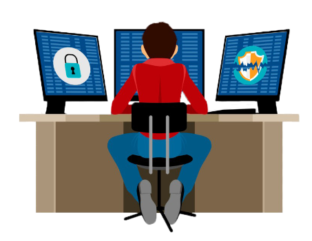

### Содержание
- [Аннотация](#аннотация)
  - [Понятие сетевой безопасности](#понятие-сетевой-безопасности)
  - [Задачи сетевого инженера](#задачи-сетевого-инженера)
- [ICAP-сервер Staffcop Enterprise](#icap-сервер-staffcop-enterprise)
  - [Функциональные возможности ICAP-сервера](#функциональные-возможности-icap-сервера)
  - [Преимущества ICAP-сервера](#преимущества-icap-сервера)
  - [Бесплатное решение контроля трафика](#бесплатное-решение-контроля-трафика)

# Аннотация

## Понятие сетевой безопасности

Сетевая безопасность — список требований, рекомендаций и политик, которые используются в сетевой инфраструктуре для повышения ее уровня защиты и отказоустойчивости. Люди, которые работают над обеспечением сетевой безопасности, называются сетевыми инженерами. 

В современном мире вопрос сетевой безопасности выходит на первое место. Конфиденциальность, целостность и доступность — основная триада информационной безопасности (Confidentiality, Integrity, and Availability, CIA), которая определяет цель процесса обеспечения информационной безопасности. В этом процессе задействовано множество стратегий и действий, которые входят в один из трех этапов: 
* предотвращение;
* обнаружение;
* реагирование.

## Задачи сетевого инженера

Основной задачей сетевого инженера является обеспечение безопасности (без ограничения функциональности) в заранее созданном контуре, например, внутреннем периметре компании. Для этого необходимо производить фильтрацию и мониторинг контента пользователей. Вариант с отсутствием контроля входящего трафика не является оптимальным, так как это не является безопасным и зачастую идет вразрез с внутренней политикой компании. 

Одним из решений данного типа задач является использование защищенного прокси-сервера и/или иных вспомогательных решений, которые могут быть гибко настроены в зависимости от нужд организации. Как правило, подобный прокси сервер представляет собой сетевую инфраструктуру со своими целями и реализацией. 

# ICAP-сервер Staffcop Enterprise

## Функциональные возможности ICAP-сервера

Решение Staffcop Enterprise включает в себя ICAP-сервер, который реализует следующие возможности:
* перехват файлов; 
* перехват данных веб-форм;
* перехват чатов в Teams; 
* перехват чатов Bitrix24;
* отслеживание истории посещения сайтов на шлюзе. 
  
Функционал находится на стадии разработки и могут быть изменения в его алгоритме. Однако уже в версии 5.1 и выше можно ознакомиться с тем, как будет выглядеть готовое решение. 
В случае наличия правильно настроенной связки прокси-сервер +  ICAP-модуль, возможно предоставление мониторинга сетевого трафика, авторизации, распространения/репликации контента и иных метрик без необходимости кэширования данных.

ICAP продукты других игроков рынка призваны дополнять дорогостоящие программные продукты без возможности отдельной установки. Компания Staffcop Enterprise предлагает отдельное решение, которое может быть куплено отдельно и встроено в любой контур. Эта особенность значительно уменьшает список технических требований к сетевой инфраструктуре и освобождает пользователя системы от дополнительных затрат на узкопрофильное оборудование и предоставляемое к нему программное обеспечение. 

## Преимущества ICAP-сервера

К преимуществам прокси-сервера можно отнести следующие возможности:

|Функционал                     |Описание                                                                                                                                                 |
|-------------------------------|---------------------------------------------------------------------------------------------------------------------------------------------------------|
|Простота настройки             |ICAP-сервер встроен по умолчанию в систему Staffcop, поэтому нет необходимости в развертке и настройке дополнительной системы                            |
|Быстрота запуска               |Сервис включается парой команд и автоматически интегрируется с основной системой                                                                         |
|Система мониторинга            |Просмотр событий перехвата осуществляется в основном веб-интерфейсе программы параллельно с событиями мониторинга                                        |
|Совместимость                  |ICAP-сервер не зависит от сторонних программ и может быть подключен как к коммерческим UTM, так и к opensource-решениям (например, Squid и т.п.)         |
|Интеграция с другими системами |При желании можно подключить дополнительные программные средства (сетевой антивирус и т.п.) сопряженные с C-ICAP, на основе которого был разработан прокси-сервер Staffcop|

## Бесплатное решение контроля трафика

В случае ограниченного бюджета или же неготовности бизнеса инвестировать значительные суммы в информационную безопасность, возможно бесплатно повысить сетевую защищенность. На рынке существуют несколько продуктов с открытым кодом, которые могут быть использованы в данном случае. Например, C-ICAP интегрирован с прокси-сервером Squid. Данное решение было использовано Staffcop Enterprise при тестировании трафика по ICAP-протоколу.

Squid предлагает расширенную среду контроля доступа, авторизации и ведения журнала для разработки веб-прокси и приложений для обслуживания контента. Кроме того, присутствует богатый набор опций оптимизации трафика, большинство из которых включены по умолчанию для упрощения установки и высокой производительности. 

